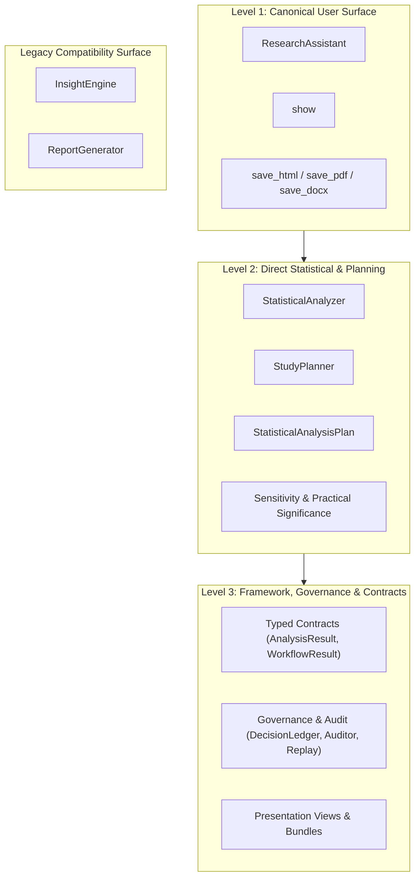

# PyAutoStat API Stability and Deprecation Policy

This document defines the stability expectations, API tiers, evolution policies, and deprecation
processes for PyAutoStat.

---

## 1. Project Status and Semantic Versioning

PyAutoStat is currently in **Alpha** (`0.5.0`, `Development Status :: 3 - Alpha`).

During the `0.x` series, PyAutoStat follows the principles of Semantic Versioning (SemVer 2.0):
- **Patch versions (`0.x.Y`)**: Bug fixes, numerical hardening, documentation improvements, and
  non-breaking performance optimizations.
- **Minor versions (`0.X.0`)**: New statistical capabilities, export formats, governance features,
  and backwards-compatible API additions. Breaking changes are avoided whenever practical, but
  may occur if required to correct statistical invalidity or close security/integrity flaws.
- **Major version (`1.0.0`)**: Production-ready release offering formal public API stability and
  strict backwards compatibility guarantees.

> [!NOTE]
> As an Alpha package in the 0.x series, PyAutoStat cannot guarantee indefinite freeze of all
> experimental or lower-level interfaces. However, changes are governed by the tiered stability
> policy described below to protect user workflows.

---

## 2. API Stability Tiers

PyAutoStat categorizes its public interfaces into three stability tiers plus a dedicated legacy
compatibility tier.

### Level 1 — Canonical User Surface

**Scope**:
- `ResearchAssistant`
- `show`
- `save_html`, `save_pdf`, `save_docx`

**Stability Intent**:
- **Highest compatibility priority**. This is the primary user-facing workflow for researchers,
  educators, and data analysts.
- Method signatures (`profile()`, `run()`, `summarize()`) and primary presentation entry points are
  treated as stable interfaces.
- Breaking changes to Level 1 APIs are avoided whenever practical. If an adjustment is required for
  scientific correctness, it will be announced well in advance with migration documentation.

### Level 2 — Direct Statistical and Planning API

**Scope**:
- `StatisticalAnalyzer`
- `StudyPlanner`, `StudyPlanningResult`
- `StatisticalAnalysisPlan`, `compare_plan_to_result`, `PlanAdherenceResult`
- `SensitivitySpecification`, `SensitivityResult`
- `MeaningfulEffectThreshold`, `PracticalSignificanceResult`

**Stability Intent**:
- Supported public API for domain experts who require direct execution without guided intake.
- These interfaces may evolve during the `0.x` lifecycle as new statistical procedures or diagnostic
  parameters are added.
- Existing methods and parameters will not be removed or renamed arbitrarily. Additions are designed
  to be backwards-compatible whenever feasible.

### Level 3 — Framework, Governance, and Typed Contracts

**Scope**:
- **Typed specifications and results**: `AnalysisSpecification`, `ResearchQuestion`, `AnalysisResult`,
  `ResearchWorkflowResult`, `MethodContract`, `METHOD_CONTRACTS`.
- **Governance and replay**: `DecisionLedger`, `StatisticalResultAuditor`, `AuditResult`,
  `ReproducibilityRecord`, `ReproductionOutcome`, `reproduce`, `ResearchSessionSnapshot`.
- **Presentation models and bundles**: `PresentationView`, `ResearchReport`, `BundleOptions`,
  `save_bundle`, `verify_bundle`, `to_html`, `to_pdf`, `to_docx`.

**Stability Intent**:
- Public and fully supported when exported and documented.
- Designed for tool builders, platform integrators, automated pipelines, and compliance systems.
- Dedicated serialized schemas are explicitly versioned (e.g. research bundle schema `BUNDLE_SCHEMA_VERSION = 1`
  and session snapshot schema `SNAPSHOT_SCHEMA_VERSION = 1`). While data structures and dataclasses may
  gain optional fields or structural refinements prior to `1.0.0`, all changes will be explicitly
  documented in `CHANGELOG.md`.

---

## 3. Legacy Compatibility Surface

**Scope**:
- `InsightEngine`
- `ReportGenerator`

**Policy**:
- **Fully supported**: These classes remain importable from `pyautostat` and continue to function
  for 0.1.x-style analysis pipelines.
- **No removal in 0.5.0**: Neither class is removed, deprecated at runtime, or broken in the 0.5.x
  release.
- **Future deprecation requirements**: If these legacy classes are eventually deprecated in a future
  release, the project will strictly adhere to the following deprecation policy:
  1. A documented, tested replacement path must exist (already available via `ResearchAssistant` and
     modern presentation exports).
  2. Clear migration documentation must be provided (available in
     [`docs/MIGRATING_FROM_0_1.md`](MIGRATING_FROM_0_1.md)).
  3. Formal deprecation warnings will be introduced at least one minor release cycle prior to any
     removal.
  4. Changes will be recorded prominently in `CHANGELOG.md`.

---

## 4. Core Scientific Design Principles and Intended Invariants

Beyond Python signatures, PyAutoStat adheres to core scientific design principles across releases (unless
a bug fix or security correction is strictly required for statistical validity or execution safety):

1. **Estimand preservation**: Diagnostic test outcomes (such as Shapiro-Wilk or Levene's tests) will
   never silently alter the scientific question or substitute a different estimand.
2. **Explicit design**: Unknown design facts (independence, pairing, clustering, event definitions)
   will never be guessed from numerical values.
3. **Zero recalculation**: Presentation, reporting, and export layers consume authoritative stored
   statistical results and do not re-execute statistical models or alter numerical values.
4. **Data preservation**: Input DataFrames are treated as read-only. Profiling and analysis will
   never mutate, sample, truncate, or impute user data.
5. **No automated p-hacking**: The library does not perform automated feature selection, stepwise
   regression, or multiple-testing threshold hunting.
