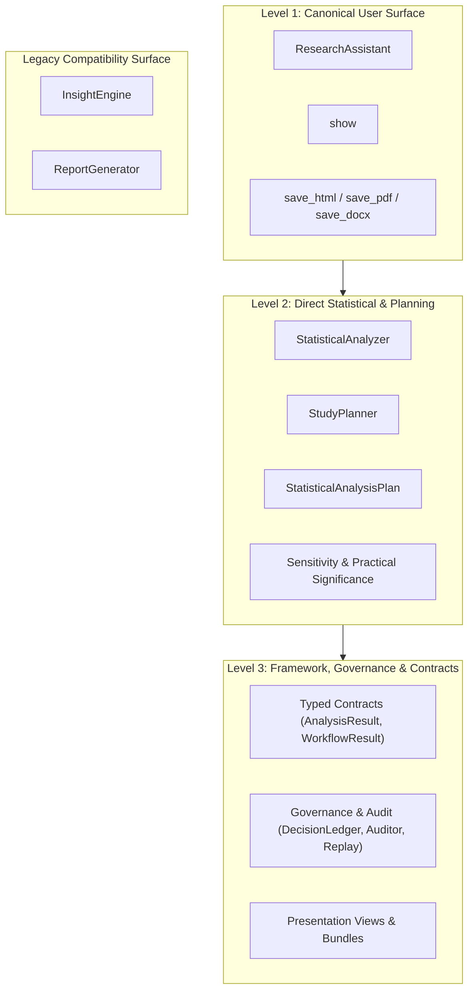

# PyAutoStat API Stability and Deprecation Policy

This document defines the stability expectations, API tiers, evolution policies, and deprecation
processes for PyAutoStat.

---

## 1. Stable status and Semantic Versioning

PyAutoStat 1.0 defines a stable public compatibility boundary under Semantic Versioning:

- **Patch releases (`1.0.x`)** contain compatible bug fixes, security fixes, documentation
  corrections, numerical hardening, and statistical-correctness fixes. Unavoidable output changes
  are documented with their scientific reason.
- **Minor releases (`1.x.0`)** may add backward-compatible capabilities, optional fields, or formal
  deprecations. Existing supported calls and payload readers continue to work.
- **Major release (`2.0.0`)** is required for intentional breaking public API or stable-schema
  changes, except for the scientific-correctness and security exceptions below.

---

## 2. API Stability Tiers

PyAutoStat classifies names as `CORE_STABLE`, `ADVANCED_STABLE`, `COMPATIBILITY_STABLE`, or
`INTERNAL_NOT_FOR_1_0`. The complete export-by-export decision is recorded in
[Public API 1.0](PUBLIC_API_1_0.md).

### Level 1 — Canonical User Surface (`CORE_STABLE`)

**Scope**:
- `ResearchAssistant`
- `show`
- `save_html`, `save_pdf`, `save_docx`

**Stability Intent**:
- **Highest compatibility priority**. This is the primary user-facing workflow for researchers,
  educators, and data analysts.
- Method signatures (`profile()`, `run()`, `summarize()`) and primary presentation entry points are
  treated as stable interfaces.
- Breaking changes to Level 1 APIs are avoided whenever practical. If an adjustment is required for
  scientific correctness, it will be announced well in advance with migration documentation.

### Level 2 — Direct Statistical and Planning API (`ADVANCED_STABLE`)

**Scope**:
- `StatisticalAnalyzer`
- `StudyPlanner`, `StudyPlanningResult`
- `StatisticalAnalysisPlan`, `compare_plan_to_result`, `PlanAdherenceResult`
- `SensitivitySpecification`, `SensitivityResult`
- `MeaningfulEffectThreshold`, `PracticalSignificanceResult`

**Stability Intent**:
- Supported public API for domain experts who require direct execution without guided intake.
- These interfaces may gain backward-compatible procedures, options, and diagnostic records during
  1.x. Existing documented methods and parameters follow the deprecation policy below.

### Level 3 — Framework, Governance, and Typed Contracts (`ADVANCED_STABLE`)

**Scope**:
- **Typed specifications and results**: `AnalysisSpecification`, `ResearchQuestion`, `AnalysisResult`,
  `ResearchWorkflowResult`, `MethodContract`, `METHOD_CONTRACTS`.
- **Governance and replay**: `DecisionLedger`, `StatisticalResultAuditor`, `AuditResult`,
  `ReproducibilityRecord`, `ReproductionOutcome`, `reproduce`, `ResearchSessionSnapshot`.
- **Presentation models and bundles**: `PresentationView`, `ResearchReport`, `BundleOptions`,
  `save_bundle`, `verify_bundle`, `to_html`, `to_pdf`, `to_docx`.

**Stability Intent**:
- Public and fully supported when exported and documented.
- Designed for tool builders, platform integrators, automated pipelines, and compliance systems.
- Dedicated serialized schemas are explicitly versioned (e.g. research bundle schema `BUNDLE_SCHEMA_VERSION = 1`
  and session snapshot schema `SNAPSHOT_SCHEMA_VERSION = 1`). While data structures and dataclasses may
  gain additive optional fields or new status values during 1.x; changes are documented in
  `CHANGELOG.md` and existing schema versions remain readable.

---

### Internal implementation (`INTERNAL_NOT_FOR_1_0`)

Names absent from `pyautostat.__all__` are internal unless another public document explicitly
promotes them. Their importability from a submodule does not create a 1.x compatibility promise.

## 3. Legacy Compatibility Surface (`COMPATIBILITY_STABLE`)

**Scope**:
- `InsightEngine`
- `ReportGenerator`

**Policy**:
- **Fully supported**: These classes remain importable from `pyautostat` and continue to function
  for 0.1.x-style analysis pipelines.
- **1.0 decision**: both classes are `COMPATIBILITY_STABLE`; neither is deprecated at runtime.
- **Preferred path**: new code should use `ResearchAssistant`, `ResearchReport`, and canonical
  presentation/export functions. See [Migration to 1.0](MIGRATION_TO_1_0.md).
- **Removal boundary**: any future deprecation follows the policy below and removal cannot occur
  before 2.0.0.

---

## 4. Public boundary and schema compatibility

The public 1.x API consists of names exported by `pyautostat.__all__`, documented public methods
on those objects, and documented versioned records. The complete boundary and tiers are recorded
in [Public API 1.0](PUBLIC_API_1_0.md). A name that is merely importable from a submodule is not
public unless the API reference or public-boundary document says it is.

Existing required serialized fields retain their meaning and type throughout 1.x. Minor releases
may add optional fields, enum/status members, and table sections when older consumers can continue
to read existing payloads. Fields are never silently repurposed to a different estimand, contrast,
unit, or design. Consumers should tolerate unknown additive fields.

## 5. Deprecation process

A public API can be removed only after a documented replacement exists, a `DeprecationWarning`
and changelog entry appear in a minor 1.x release, migration guidance identifies behavioral and
schema differences, and the API remains available for at least one subsequent minor release and
normally at least six months. Removal occurs no earlier than 2.0.0.

## 6. Scientific-correctness and security exceptions

Compatibility does not require preserving a known statistical error. A patch release may correct
a formula, estimand label, orientation, degrees of freedom, p-value, effect estimate, interval,
sample-accounting rule, recommendation, or interpretation when current behavior is scientifically
wrong. The prior and corrected behavior, affected methods, and validation evidence must be
documented; the research question must not be silently changed.

A patch release may immediately change or disable behavior that exposes raw data, participant
identifiers, credentials, executable content, unsafe archive paths, formula injection, or another
material security/privacy risk. Compatibility impact is documented without publishing details
that would increase risk.

## 7. Core Scientific Design Principles and Intended Invariants

Beyond Python signatures, PyAutoStat adheres to core scientific design principles across releases (unless
a bug fix or security correction is strictly required for statistical validity or execution safety):

1. **Estimand preservation**: Diagnostic test outcomes (such as Shapiro-Wilk or Levene's tests) will
   never silently alter the scientific question or substitute a different estimand.
2. **Explicit design**: Unknown design facts (independence, pairing, clustering, event definitions)
   will never be guessed from numerical values.
3. **Zero recalculation**: Presentation, reporting, and export layers consume authoritative stored
   statistical results and do not re-execute statistical models or alter numerical values.
4. **Data preservation**: Input DataFrames are treated as read-only. Profiling and analysis will
   never mutate, sample, truncate, or impute user data.
5. **No automated p-hacking**: The library does not perform automated feature selection, stepwise
   regression, or multiple-testing threshold hunting.
